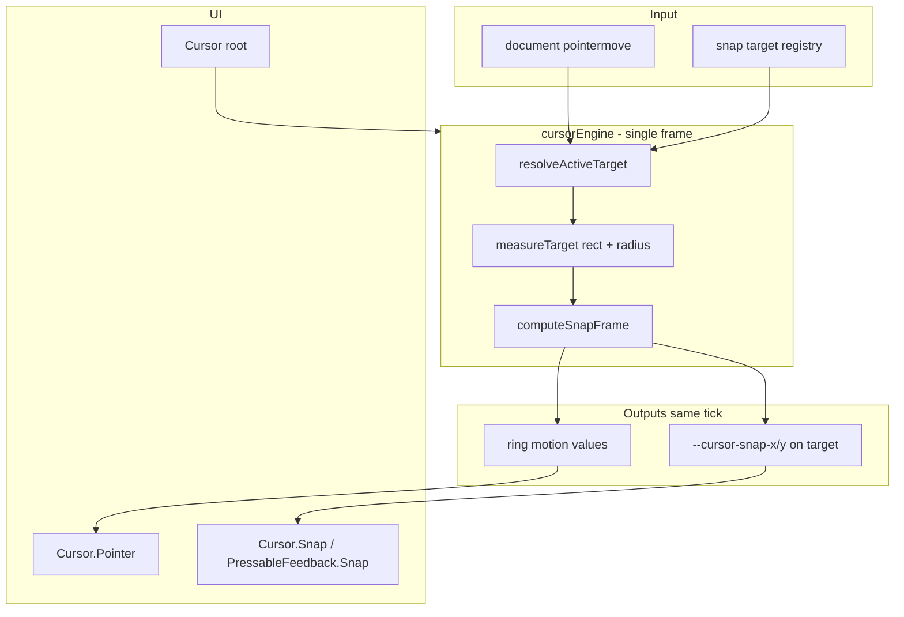

# Cursor Engine Redo (holistic snap + morph + parallax)

## Goal

Replace the current three-pipeline design (React `snap` state + `Cursor.Pointer` re-derivation + imperative `CursorSnapParallax`) with **one shared engine** that, per pointer frame, outputs:

1. **Magnetic** — which registered target is active (if any)
2. **Morph** — custom ring geometry aligned to that target
3. **Parallax** — target element shift toward the pointer

Integrate with pressables via **`PressableFeedback.Snap`**, which wraps the **`Cursor.Snap`** registration API and applies influence on the same DOM node PressableFeedback already owns.

**Migration policy (confirmed):** one-pass — remove `data-cursor-snap` / `Button cursorSnap`; update all call sites in the same PR.

---

## Target architecture



**Rule:** React re-renders only on **phase changes** (`idle` → `snapped`, target id change, `disabled`). Per-frame ring + parallax updates write to **Motion values** and **CSS variables** without `setState` on every `pointermove`.

Follow the registry pattern from [`stack.context.tsx`](src/components/stack/stack.context.tsx): `subscribe` / `getSnapshot` / stable snapshot equality.

---

## Public API (after redo)

### Cursor shell

```tsx
import { Cursor } from '@/components/cursor'

<Cursor debug>
  {app}
</Cursor>
```

- **`Cursor.Pointer` auto-mounted** inside [`cursor.root.tsx`](src/components/cursor/cursor.root.tsx) (portal or sibling) — consumers no longer add it manually.
- Update [`src/routes/(environment)/route.tsx`](src/routes/(environment)/route.tsx) to drop explicit `<Cursor.Pointer />`.

### Snap registration (Option B)

```tsx
import { Cursor } from '@/components/cursor'

<Cursor.Snap id="app-store-cta" padding={0}>
  <motion.div>...</motion.div>
</Cursor.Snap>
```

| Prop | Purpose |
|------|---------|
| `id` | Stable registry key (required) |
| `padding?` | Morph inset on ring (px) |
| `strength?` | Optional parallax scale multiplier (default `1`) |

`Cursor.Snap` merges a ref onto its child (single child / `render` prop if needed for Base UI parity), registers/unregisters with the engine on mount/unmount, and applies the snap-target CSS class bundle.

### Pressable integration (Option B + C)

```tsx
import { PressableFeedback } from '@/components/pressable-feedback'

<PressableFeedback.Snap
  id="ornament-tab"
  render={<Button variant="secondary" />}
  animation={false}
>
  <PressableFeedback.Highlight />
  {children}
</PressableFeedback.Snap>
```

**`PressableFeedback.Snap`** = `PressableFeedback.Root` + **`useSnapTargetRef`** merged into the existing `setTarget` ref in [`pressable-feedback.root.tsx`](src/components/pressable-feedback/pressable-feedback.root.tsx), plus snap layout class.

- **Same HTMLElement** for press feedback (`--pressable-feedback-x/y` for highlight) and cursor snap (`--cursor-snap-x/y` for translate).
- No `data-cursor-snap` attribute.

---

## Unified frame model

New file: [`src/components/cursor/cursor.engine.ts`](src/components/cursor/cursor.engine.ts)

```ts
type CursorPhase = 'idle' | 'free' | 'snapped'

type CursorFrame = {
  phase: CursorPhase
  pointer: { x: number; y: number }
  pressed: boolean
  targetId: string | null
  ring: {
    x: number
    y: number
    width: number
    height: number
    borderRadius: string
    opacity: number
  }
  influence: { x: number; y: number } // parallax delta applied to active target
}
```

Single pure function (port existing math from [`cursor.parallax.ts`](src/components/cursor/cursor.parallax.ts) + [`cursor.pointer.tsx`](src/components/cursor/cursor.pointer.tsx) `getSnapMetrics`):

```ts
computeSnapFrame(pointer, target: MeasuredTarget | null, config): CursorFrame
```

- **Magnetic:** `resolveActiveTarget(pointer, registry)` — direct hit on registered element, else expanded rect from [`getMagneticExpansion`](src/components/cursor/cursor.snap.ts) (move logic into engine; delete DOM `querySelectorAll`).
- **Morph:** ring box = target rect (minus padding); position = pointer clamped inside padded rect; `borderRadius` from measured style.
- **Parallax:** `influence` = `computeSnapParallaxOffset(pointer, target.rect)` — same formula, applied in same `applyFrame`.

---

## Store + apply layer

New files:

| File | Role |
|------|------|
| [`cursor.store.ts`](src/components/cursor/cursor.store.ts) | Registry `Map<id, { element, padding, strength }>`, pointer state, `subscribe` / `getSnapshot`, `snapshotsEqual` |
| [`cursor.apply.ts`](src/components/cursor/cursor.apply.ts) | `applyFrame(frame)`: update ring Motion values; set/clear `--cursor-snap-x/y` on active/inactive targets |
| [`cursor.use-snap-target.ts`](src/components/cursor/cursor.use-snap-target.ts) | `useSnapTargetRef({ id, padding, strength })` for `Cursor.Snap` / `PressableFeedback.Snap` |

**Snapshot contents for React:** `phase`, `targetId`, `pressed`, `disabled`, `hasPointer` — not full rect (rect stays in engine refs).

**Ring Motion values** owned by store/engine (created once in `Cursor` provider): `ringX`, `ringY`, `ringWidth`, `ringHeight`, `ringRadius`, `ringScale`.

[`cursor.pointer.tsx`](src/components/cursor/cursor.pointer.tsx) becomes thin: read ring motion values + `useSyncExternalStore` for phase/pressed only; remove duplicate `targetX/Y` springs and `pointerX.on('change')` subscriptions.

---

## CSS contract (Option C)

Replace [`cursor.styles.css`](src/components/cursor/cursor.styles.css) with a single snap-target class:

```css
.cursor-snap-target {
  --cursor-snap-x: 0px;
  --cursor-snap-y: 0px;
  translate: var(--cursor-snap-x) var(--cursor-snap-y);
}
```

Engine writes `--cursor-snap-x/y` each frame via `element.style.setProperty` (or Motion animate only on **target change** / reset — not per-frame `animate()` calls).

Keep PressableFeedback’s existing vars for highlight tilt:

```css
[--pressable-feedback-x:0px] [--pressable-feedback-y:0px]
```

on [`pressable-feedback.root.tsx`](src/components/pressable-feedback/pressable-feedback.root.tsx) — unchanged responsibility. **No second imperative parallax path.**

---

## Module layout (replace current 17 files)

```text
src/components/cursor/
  cursor.tsx                    # namespace: Cursor, Snap
  cursor.root.tsx               # provider, document listeners, auto Pointer + debug
  cursor.pointer.tsx            # thin visual
  cursor.snap.tsx               # Cursor.Snap registration wrapper
  cursor.engine.ts              # computeSnapFrame + resolveActiveTarget
  cursor.store.ts               # registry + subscribe/getSnapshot
  cursor.apply.ts               # applyFrame to motion + CSS vars
  cursor.use-snap-target.ts
  cursor.use-capabilities.ts    # keep (useSyncExternalStore)
  cursor.types.ts
  cursor.constants.ts
  cursor.animation.ts
  cursor.styles.css
  cursor.debug.ts               # keep, wire to store snapshot
  cursor.debug-panel.tsx
  index.ts
  __test__/cursor.engine.test.ts  # port parallax + frame tests
```

**Delete after port:**

- [`cursor.snap-parallax.tsx`](src/components/cursor/cursor.snap-parallax.tsx)
- [`cursor.parallax.motion.ts`](src/components/cursor/cursor.parallax.motion.ts)
- [`cursor.snap.ts`](src/components/cursor/cursor.snap.ts) (logic moves to `cursor.engine.ts`)
- [`cursor.parallax.ts`](src/components/cursor/cursor.parallax.ts) (inline into engine or keep as `cursor.engine.parallax.ts` re-export for tests)
- [`cursor.context.tsx`](src/components/cursor/cursor.context.tsx) — replace with `useCursorStore()` / `useCursorFrame()` from store (minimal public surface)

```text
src/components/pressable-feedback/
  pressable-feedback.snap.tsx     # PressableFeedback.Snap
  pressable-feedback.tsx          # add Snap to namespace
  pressable-feedback.types.ts     # PressableFeedbackSnapProps
```

---

## PressableFeedback.Snap implementation notes

1. Add optional `ref` merge helper (or extend `setTarget` in root) so `useSnapTargetRef` and PressableFeedback’s `targetRef` point at the **same** node.
2. `PressableFeedback.Snap` forwards all `PressableFeedbackRootProps` except requires `id`.
3. Add `cursor-snap-target` to `className` via `cn()`.

Reference composition today: [`ornament.tab.tsx`](src/components/ornament/ornament.tab.tsx) uses `PressableFeedback` + `data-cursor-snap` — migrate to `PressableFeedback.Snap`.

---

## One-pass call site migrations

| Location | Change |
|----------|--------|
| [`src/routes/(environment)/route.tsx`](src/routes/(environment)/route.tsx) | `<Cursor>{children}</Cursor>` only (no `Cursor.Pointer`) |
| [`src/routes/(environment)/(apps)/app-store/index.tsx`](src/routes/(environment)/(apps)/app-store/index.tsx) | `PressableFeedback.Snap id="app-store-test" render={<Button>...` |
| [`src/components/ornament/ornament.tab.tsx`](src/components/ornament/ornament.tab.tsx) | `PressableFeedback.Snap id={...}` remove `data-cursor-snap` |
| [`src/components/browser-compatibility-banner/browser-compatibility-banner.tsx`](src/components/browser-compatibility-banner/browser-compatibility-banner.tsx) | `PressableFeedback.Snap` or `Cursor.Snap` around dismiss `Button` |
| [`src/screens/home/home.items.tsx`](src/screens/home/home.items.tsx) | `Cursor.Snap id={item.id}` around home cell `motion.div` |
| [`src/components/button/button.tsx`](src/components/button/button.tsx) | **Remove** `cursorSnap` prop + `data-cursor-snap` |
| [`src/components/button/button.types.ts`](src/components/button/button.types.ts) | Remove `cursorSnap` from types |

---

## Engine loop (pseudocode for next agent)

```ts
function onPointerMove(e: PointerEvent) {
  const pointer = { x: e.clientX, y: e.clientY }
  const target = engine.resolveTarget(pointer, registry)
  const frame = computeSnapFrame(pointer, target, { pressed, config })
  applyFrame(frame, registry, ringMotionValues)

  const prev = store.getSnapshot()
  if (phaseOrTargetChanged(prev, frame)) store.emit()
}
```

**Observers:** single `ResizeObserver` + capture `scroll` on **active target element only** (same as today, but owned by store when `targetId` changes — not in a separate React component).

---

## Debug + tests

- Keep `?cursor-debug=1` / `debug` prop; panel reads `cursorStore.getSnapshot()` + live ring vars + active target `--cursor-snap-x/y`.
- Expand [`__test__/cursor.parallax.test.ts`](src/components/cursor/__test__/cursor.parallax.test.ts) → `cursor.engine.test.ts`: magnetic selection, frame at center/edge, phase transitions.
- Manual: `/app-store` — ring morphs, button translates, debug panel shows non-zero influence.

---

## Implementation order (for handoff)

1. **Scaffold** `cursor.engine.ts`, `cursor.store.ts`, `cursor.apply.ts`, types — no UI yet; unit tests green.
2. **Rewire** `cursor.root.tsx` + thin `cursor.pointer.tsx`; auto-mount pointer; remove old snap state / parallax component.
3. **Add** `cursor.snap.tsx` + `useSnapTargetRef`.
4. **Add** `pressable-feedback.snap.tsx` + namespace export.
5. **Migrate** all call sites (table above); remove `cursorSnap` / `data-cursor-snap`.
6. **Delete** obsolete cursor files; run `npm run test:cursor`, `types:check`, `lint`.
7. **Verify** ornament tabs, app-store button, home cells in browser with `?cursor-debug=1`.

---

## Out of scope (this redo)

- Fumadocs page for Cursor
- Spatial index for registry (only needed if snap target count grows large)
- `Cursor.Snap` render-prop parity with every Base UI polymorphic edge case beyond one child + ref merge
- Changing PressableFeedback highlight/scale behavior (only add Snap wrapper)

---

## Risks / mitigations

| Risk | Mitigation |
|------|------------|
| Ref merge breaks PressableFeedback `setTarget` | Test `PressableFeedback.Snap` with `render={<Button />}` first (ornament + app-store) |
| Motion `scale` on pressable vs `translate` | Keep `translate` on separate CSS property (already used in current `cursor.styles.css`) |
| Engine + PressableFeedback both listen to pointer | Cursor uses document capture; PressableFeedback keeps local handlers for highlight only — no duplicate snap logic |
| One-pass breaks docs/examples | Grep `cursor-snap` / `cursorSnap` before merge |
