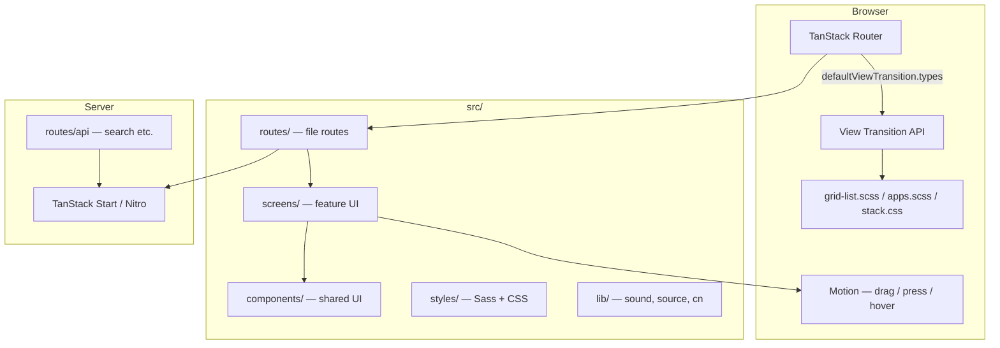

# Vision UI — Architecture

This document is the map for humans and coding agents: how the app is layered, where behavior lives, and what to touch when adding UI. It complements the public docs site (Fumadocs) and the **react-composition-structure** agent skill.

---

## 1. What this doc is for

| Audience | Use it to |
|----------|-----------|
| **Contributors** | Find the right folder before opening files; understand motion vs CSS boundaries |
| **Agents** | Follow checklists when creating routes, screens, or components; know which skill to load |
| **Design / eng review** | See how route shape drives animation without React branching |

**Fumadocs** (`content/docs/`, `/docs` routes) documents *how to use* components. **This file** documents *how the repo is shaped* and *where logic is allowed to live*.

---

## 2. System overview



**Rule of thumb:** if it depends on *where you navigated from*, it belongs in **`router.tsx` + CSS types**. If it depends on *finger position while dragging*, it belongs in **Motion**.

---

## 3. Directory contract

| Path | Owns | Does not own |
|------|------|----------------|
| `src/routes/` | Route definitions, loaders, thin `component` wrappers | Heavy layout, animation math, business UI |
| `src/screens/<feature>/` | Feature layout, `*.items.tsx` renderers, feature hooks | Generic primitives |
| `src/components/<name>/` | Reusable compound UI (`ornament`, `stack`, `grid-list`, `surface`, …) | Route-specific copy or path checks |
| `src/styles/` | Global motion tokens, view-transition keyframes, `@starting-style` | Component-specific React state |
| `src/lib/` | Cross-cutting utilities (sound, Fumadocs `source`, `cn`) | Feature-only orchestration |
| `src/router.tsx` | Global router options, **view transition type** selection | Per-component styles |

### Route groups

```text
(environment)/          # Shell: Cursor, Environment backdrop, Outlet
  (ornament)/           # Home, People, Environments — honeycomb grids
  (apps)/               # Settings, App Store, … — Stack chrome
docs/                   # Fumadocs
api/                    # e.g. search
```

`router.tsx` treats **ornament paths** (`/`, `/people`, `/environments`) separately from **app paths** (everything else under `/` except `/docs`, `/api`, `/llms`).

---

## 4. Composition model

Vision UI follows **compound components** (namespace + leaves), aligned with:

- **react-composition-structure** (this repo: `.agents/skills/react-composition-structure/`) — folders, `index.ts`, `*.data.ts`, naming
- **vercel-composition-patterns** (optional) — boolean prop avoidance, provider shape

### Examples in this codebase

| Module | Public API | Role |
|--------|------------|------|
| `Ornament` | `Ornament`, `Ornament.Tab`, … | Left rail + tab chrome for ornament routes |
| `Stack` | `Stack`, `Stack.Screen`, `Stack.Toolbar`, … | App window frame inside `(apps)/` |
| `GridList` | `GridList`, `ListRenderItemInfo`, grid utils | Honeycomb layout, paging, cell geometry |
| `Surface` | `Surface` | Glass panel with CSS-driven rim highlights |
| `Cursor` | `Cursor`, `Cursor.Pointer`, … | Custom pointer + snap targets |
| `PressableFeedback` | `PressableFeedback` | Press highlight / scale feedback |

Each module should expose **one root** from `index.ts`. Internal leaves stay internal unless deliberately public (see skill: `boundaries-public-api`).

### Feature screens pattern

```text
screens/home/
  home.layout.tsx      # <GridList renderCell={renderHomeCell} />
  home.items.tsx       # items[] + renderCell (per-tile UI + VT classes)
  home.hooks.ts        # Route matching helpers (optional)
```

Routes stay thin:

```tsx
// routes/(environment)/(ornament)/index.tsx
import GridListScreen from '@/screens/home/home.layout'
export const Route = createFileRoute('/(environment)/(ornament)/')({
  component: GridListScreen,
})
```

When a feature grows (settings is the reference), split **layout**, **data**, **nav rows**, and **screens** under `screens/settings/` with a barrel `index.ts`.

---

## 5. View transitions

### 5.1 Router assigns types

`src/router.tsx` → `defaultViewTransition.types({ fromLocation, toLocation })`:

| Type | When | CSS file |
|------|------|----------|
| `home-app-launch` | `/` ↔ app path | `grid-list.scss` (cell exit/enter), `apps.scss` (app root fade) |
| `ornament-tab-switch` | ornament path ↔ ornament path | `grid-list.scss` (tab-switch keyframes) |
| `false` | Everything else | Browser default / none |

No type is required per app route — **`isAppPath()`** is the gate.

### 5.2 CSS selects animations

Active type on the document root:

```css
:root:active-view-transition-type(home-app-launch) { … }
```

Snapshots use **classes** from React’s `viewTransitionClass` (TanStack Router), because custom properties on the live DOM are **not** copied to `::view-transition-old/new`.

### 5.3 Grid cell pipeline

```text
renderCell / home.items.tsx
  ├─ data-slot="grid-cell"
  ├─ style: getGridCellStyle() → --row-offset, --col-offset, --stagger-delay
  └─ viewTransitionClass: getGridCellViewTransitionClass()
        → grid-cell grid-cell-stagger-{n} grid-cell-rx-* grid-cell-ry-*

grid-list.utils.ts
  └─ getStaggerDistanceFromCenter() — honeycomb distance from center tile

grid-list.scss
  ├─ @starting-style — first paint (when no VT type active)
  ├─ home-app-launch — grid-cell-exit / grid-cell-enter
  └─ ornament-tab-switch — grid-cell-tab-switch-exit / enter
```

**Leaving home for an app:** cells are `::view-transition-old` → **exit**.  
**Returning home:** cells are `::view-transition-new` → **enter** (same keyframes, opposite role — no separate “reverse” timeline).

### 5.4 What Motion still does

`GridList` pager: horizontal drag, velocity snap, scroll-linked scale/blur/opacity on off-screen cells, neighbor **press attraction**. That is continuous input tracking — poor fit for pure CSS.

Keep new **enter/exit** choreography in **CSS** unless you have a strong reason to snapshot in JS.

---

## 6. Styling layout

| File | Purpose |
|------|---------|
| `styles/grid-list.scss` | Grid cell tokens, `@starting-style`, VT keyframes + stagger maps |
| `styles/apps.scss` | `apps-root` match-element + fade on app enter |
| `styles/stack.css` | Stack root zoom under generic `:active-view-transition` |
| `styles/animation.css` | Shared zoom/fade utilities |
| `styles/styles.scss` | Sass entry (`@use` grid-list, home, apps) |
| `styles/app.css` | Tailwind entry |

Component folders may ship colocated `*.styles.ts` (e.g. `surface.styles.ts`, `ornament.styles.ts`) for variants tokens consumed by Tailwind class strings.

---

## 7. APIs and data

| Surface | Location | Notes |
|---------|----------|--------|
| Docs search | `src/routes/api/search.ts` | Orama via Fumadocs `createFromSource` |
| Docs content | `content/docs/` + `src/lib/source.ts` | MDX pipeline (`fumadocs-mdx`) |
| Client state | Zustand (`persist` + `immer` in `src/lib/preferences/`) | User prefs (environment, sound); cursor uses custom store |
| Sound | `src/lib/sound/` | Effects + ambient hooks |

There is no separate REST backend for the demo UI; server routes are for **docs/search** and Start SSR.

---

## 8. Agent checklist: new shared component

Load **react-composition-structure** and apply by priority:

1. **Compound folder?** (multiple leaves, shared context) → `components/<stem>/` with `<stem>.tsx`, `<stem>.context.tsx`, `index.ts`
2. **Single primitive?** → still use one stem; avoid `Component.tsx` + `ComponentInner.tsx` sprawl
3. **Export** only the namespace from `index.ts` unless a second public entry is intentional
4. **Naming:** `<stem>.types.ts`, `<stem>.constants.ts`, `<stem>.styles.ts` as needed
5. **Motion:** default to CSS transitions; use Motion for drag, springs tied to gesture, or layout that CSS cannot see
6. **View transitions:** if shared elements cross routes, use `view-transition-name: match-element` + `viewTransitionClass` with classes defined in `styles/`, not inline vars on snapshots
7. **Docs:** add MDX under `content/docs/` if the component is user-facing; link from README only for major features
8. **Tests:** colocate in `__test__/` inside the module when added (skill: organization-colocate-internals)

---

## 9. Agent checklist: new ornament screen (grid)

1. Add route under `src/routes/(environment)/(ornament)/`
2. Create `src/screens/<name>/` with `*.layout.tsx` + `*.items.tsx`
3. Use `<GridList items={…} renderCell={…} />`
4. In `renderCell`, destructure `rowIndex`, `colIndex`, `middleRowCols` from `ListRenderItemInfo`
5. Apply `getGridCellStyle()` on the element with `data-slot="grid-cell"`
6. For home-only app links, add `viewTransitionClass: getGridCellViewTransitionClass(...)` on the same node that should match-element (see `home.items.tsx`)
7. Do **not** duplicate stagger math — extend `grid-list.utils.ts` if geometry changes
8. If a new navigation shape needs new motion, add a **router type** in `router.tsx` and a matching `:active-view-transition-type(...)` block in `grid-list.scss`

---

## 10. Agent checklist: new app route

1. Add file under `src/routes/(environment)/(apps)/…`
2. Wrap UI in `Stack` / `Stack.Screen` (follow settings routes)
3. Ensure path is classified by `isAppPath()` in `router.tsx` (automatic `home-app-launch`)
4. Put `data-slot="apps-root"` on the app root container if the whole pane should participate in launch VT (`apps.scss`)
5. Use `<Link viewTransition>` (or rely on `defaultViewTransition`) when navigating from home icons

---

## 11. Documentation standards

When writing or updating docs:

| Doc | Lives in | Should answer |
|-----|----------|----------------|
| **README.md** | repo root | Why the project is interesting; stack; quick start |
| **architecture.md** | repo root | Repo shape, VT pipeline, agent checklists (this file) |
| **Component / guide MDX** | `content/docs/` | Props, examples, a11y, do/don’t for consumers |
| **Component `*.md` in folder** | e.g. `components/stack/stack.md` | Short pointer to full MDX URL |
| **Agent skill** | `.agents/skills/` | Repeatable file-system rules; link to `AGENTS.md` in skill for full text |

**Do not** duplicate long API tables in both architecture.md and Fumadocs — link outward.

**Do** document non-obvious constraints agents hit:

- View transition snapshots need **classes**, not CSS variables from the live cell
- `@starting-style` is disabled while `home-app-launch` or `ornament-tab-switch` is active
- `prefers-reduced-motion: reduce` gates motion in `grid-list.scss`

---

## 12. Skills map

| Task | Skill / doc |
|------|-------------|
| Folder structure, barrels, `*.data.ts` | `.agents/skills/react-composition-structure/` |
| Compound component API design | `vercel-composition-patterns` (if installed) |
| TanStack Start / Router patterns | `.agents/skills/tanstack-start-best-practices/` |
| This repo’s VT + grid behavior | This file + `src/styles/grid-list.scss` + `src/router.tsx` |

When an agent is asked to **restructure** a folder, read the matching rule file under `react-composition-structure/rules/` rather than improvising naming.

---

## 13. Mental model (one paragraph)

**Routes** name the transition and render a screen. **Screens** wire data and `renderCell` into **GridList** or **Stack**. **Components** stay reusable and namespace-exported. **CSS** owns enter/exit/stagger off router types and `@starting-style`. **Motion** owns fingers and physics. Keeping that separation is what lets the honeycomb feel complex while the code stays boring — in the good way.
